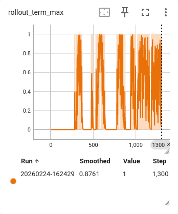
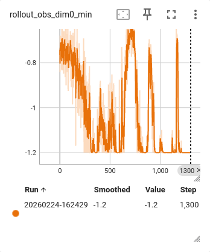
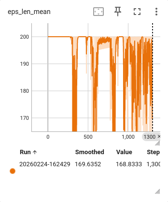
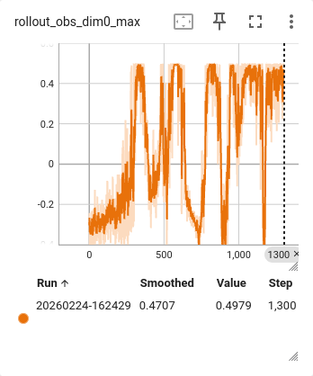

# RL Hard Exploration

Based on a concept from a previous version of the Neural Network matrix, I explored the possibility of using something similar to help with hard exploration tasks while injecting minimal inductive bias.

## Base RL Algorithm

Vanilla Bellman Q-value updates, off-policy with a replay buffer. Actions sampled via softmax over discrete Q(s,a). A smallish network with some overfitting guardrails (not dropout).

## Results

A final experiment yielded promising results on Mountain Car. The screenshots show that the algorithm finds viable solutions — the car learns to swing up and reach the goal.

| Metric | What it shows |
|--------|--------------|
|  | **Terminal max** — reaching 1.0 means the car reaches the goal |
|  | **Position min** — the car swings to the left wall (-1.2) to build momentum |
|  | **Episode length** — drops from 200 (timeout) when solutions are found |
|  | **Position max** — reaching ~0.5, the goal position |

The instability is visible — the algorithm finds solutions but tends to regress. This is expected: stabilisation is a separate challenge from finding solutions in the first place, and arguably the easier one.

## TODO

- Fine-tune hyperparameters
- Compare different flavours of the algorithm to improve stability
- Investigate why regressions occur and whether a simple fix suffices
- Test on other hard-exploration environments
- Understand behaviour when the reward stream is continuous rather than sparse, and in mixed setups
